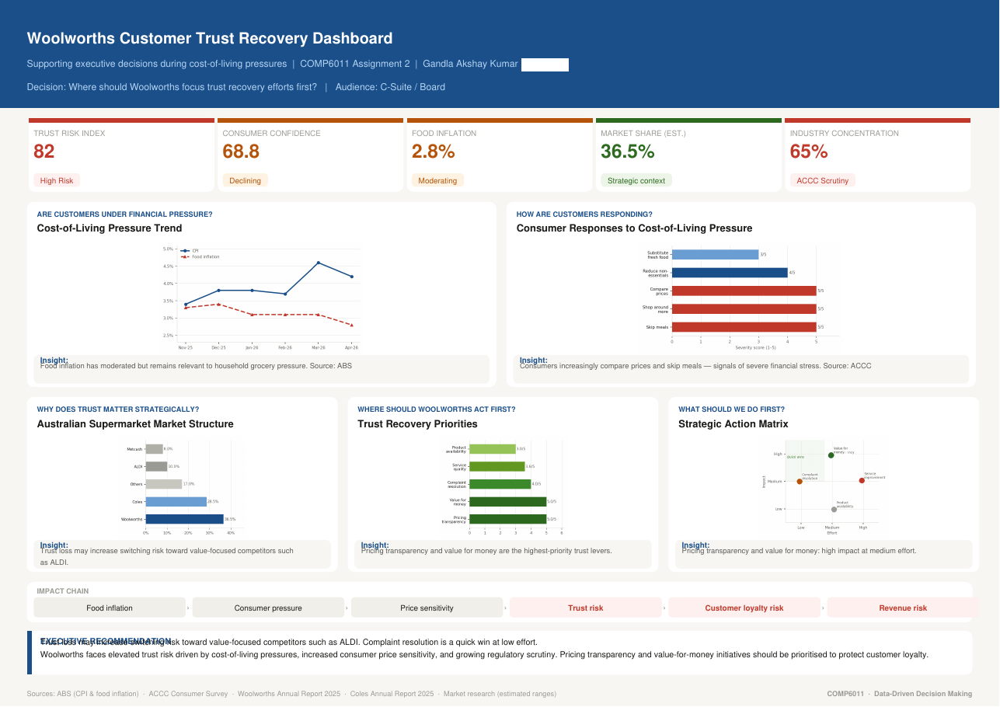

# Woolworths Customer-Trust Recovery: Executive Dashboard

A three-stage **data-driven decision-making** project: frame a business problem, plan a dashboard, then build an executive **Tableau** dashboard to answer *"Where should Woolworths focus trust-recovery efforts first?"* for a C-suite / board audience.

## Stages
1. **Framing the opportunity** (`docs/01_framing_the_opportunity.docx`): organisational priority briefing on Woolworths' customer-trust decline during cost-of-living pressure, stakeholders affected, the strategic urgency (share shift toward value competitors such as ALDI), and six primary and supporting analytical questions with relevance statements.
2. **Dashboard prototype brief** (`docs/02_dashboard_prototype_brief.docx`): six refined questions (trust trend, satisfaction by store format, complaint intensity by region and category, geographic concentration, price-fairness vs basket value across income bands, complaint rate by store size), the KPI / trend / comparison / geographic visual design, an AI-use statement and references.
3. **Executive dashboard** (`tableau/Woolworths_CEO_Dashboard_v3.twbx`, packaged workbook with its data extract): KPI strip (Trust Risk Index 82 "High Risk", consumer confidence 68.8, food inflation 2.8%, estimated market share 36.5%, 65% industry concentration), consumer-pressure and response charts, a trust-recovery priority ranking, a strategic action matrix, an impact chain (food inflation to consumer pressure to price sensitivity to trust risk to loyalty to revenue) and an executive recommendation: **prioritise pricing transparency and value-for-money, with complaint resolution as a low-effort quick win**.

## Data and honesty note
Context figures cite public sources (ABS CPI and food inflation, ACCC consumer survey, Woolworths and Coles FY25 annual reports). **Several dashboard inputs are prototype or estimated ranges and mock data** where internal company data was unavailable (stated in the project documents), so the dashboard demonstrates the analytical design and storytelling, not validated findings about Woolworths.

## Skills demonstrated
Business problem framing, KPI design, dashboard storytelling for executives, Tableau, data visualisation, stakeholder analysis, responsible AI-use disclosure.

## Open the workbook
Open `tableau/Woolworths_CEO_Dashboard_v3.twbx` in Tableau Desktop or the free Tableau Reader.

## Context
Completed as part of the MSc in Artificial Intelligence & Machine Learning at the University of Adelaide (Data-Driven Decision Making, COMP 6011, 2025). Individual work.

## Licence
MIT. See [LICENSE](LICENSE). Third-party datasets and course materials are not redistributed.
